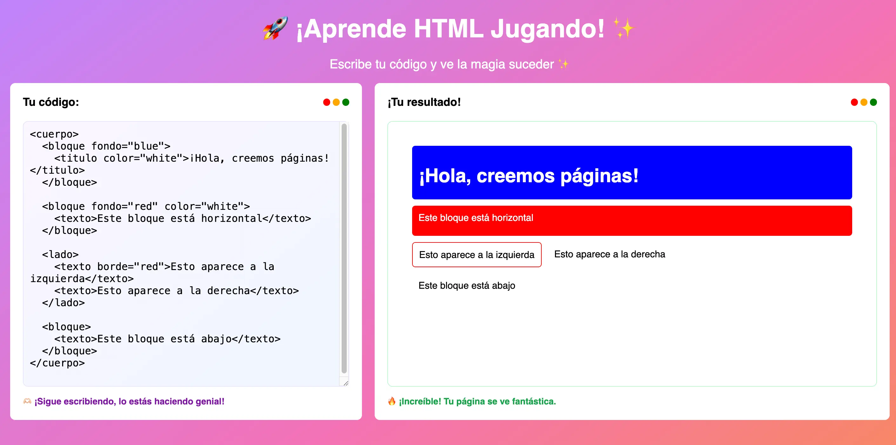

# HTML Kids

Enseña a los niños a crear páginas web con este lenguaje HTML simplificado.

## Docs

- `fondo="blue"`
- `color="red"`
- `borde="green"`

### Colores

Usa `fondo="blue"` o `color="red"` para cambiar colores de fondo o texto. Los colores son en inglés y pueden ser cualquiera soportado por HTML.

### Texto

Usa `<titulo>` para títulos grandes y `<texto>` para párrafos

### Estructura

Usa `<bloque>` para cajas y `<lado>` para poner cosas al lado

## Licencia

Este proyecto está bajo la Licencia Apache.
© 2025 Alejandro Sobko.

Ver [LICENSE](./LICENSE) para más información.
